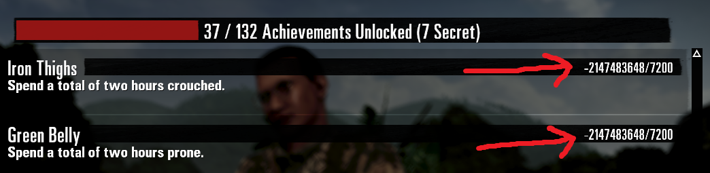

# Rising Storm 2 Stats Fixer

Actor for fixing bugged stats in Rising Storm 2: Vietnam. Does not de-rank dedicated servers.

If some of your stats are bugged (very large negative values), this mod can fix them.



## Instruction

1. Install the mod from Steam Workshop (link below) on your dedicated server.
2. Launch the `VNTE-StatsFixerLevel` map.
3. Join the server and say the following command in text chat: `FixMe`.


This will fix the following bugged stats (negative values):

```
HumanKills
MGKills
MeleeKills
SniperKills
TEWins
SUWins
SKWins
FFWins
BayonetKills
TimeCrouched
TimeProned
Mantles
GunshipKills
HeloInsertions
SpawnsInHelos
CobraTurretKills
TimeInCamo
DoorGunnerKills
SprintDist
CrouchSprintDist
TimeOnLadders
BushrangerPilotKills
BushrangerGunnerKills
GarandReloads
```

Open a new GitHub issue if there's a stat the mod did not fix for you.

## Steam Workshop

https://steamcommunity.com/sharedfiles/filedetails/?id=3568295875
